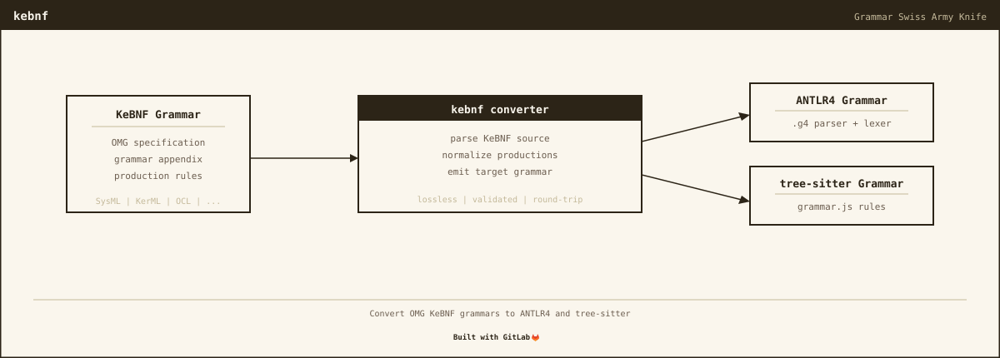

# kebnf

[](https://nomograph.ai)
[](https://crates.io/crates/kebnf)
[](LICENSE)
[](https://gitlab.com/nomograph/kebnf/-/pipelines)


Convert OMG KeBNF grammar specifications to parser grammars. Parses the
full KerML + SysML v2 KeBNF specs (640 rules) and emits target-specific
output with semantic traceability.

## Output Formats

| Format | Flag | Output | Status |
|--------|------|--------|--------|
| **ANTLR4** | `--format antlr4` | `.g4` | **CI-validated** -- compiles with antlr4 4.13.2, javac 21 |
| **tree-sitter** | `--format tree-sitter` | `grammar.js` | **CI-validated** -- 96.9% corpus coverage (186/192), 0.15ms parse speed. 11 categories at 100%. |

## Quick Start

```bash
# Build from source
cargo build --release

# Convert SysML v2 KeBNF to ANTLR4 grammar
./target/release/kebnf KerML.kebnf SysML.kebnf --format antlr4 -o Sysml.g4

# Fetch the latest specs from the OMG GitHub repo, then convert
./target/release/kebnf --fetch-spec
./target/release/kebnf ~/.cache/kebnf/*.kebnf --format antlr4 -o Sysml.g4
```

## Getting the .g4 File

The CI pipeline generates and validates `Sysml.g4` on every commit.
Download it from the latest pipeline:

**Pipeline** > **antlr4-validate** job > **Artifacts** > `Sysml.g4`

Or browse: [latest pipeline artifacts](https://gitlab.com/nomograph/kebnf/-/pipelines/latest)

## CI Validation

Every push runs a five-stage validation:

1. **rust-build** -- zero compiler warnings
2. **rust-test** -- 30 tests pass
3. **rust-clippy** -- zero lint warnings
4. **antlr4-validate** -- generate .g4 from full KerML+SysML, compile with
   `antlr4 4.13.2` (zero errors), compile generated Java with `javac 21`
5. **tree-sitter-validate** -- generate grammar.js from full KerML+SysML,
   run `tree-sitter generate` (valid parser.c produced)

## Tree-sitter Backend

The tree-sitter backend uses pattern-based emission: each definition and
usage rule has its prefix keywords inlined for early disambiguation.
This eliminates the shared-prefix ambiguity that causes GLR timeout in
naive conversion approaches.

**Corpus coverage: 96.9%** (186/192 test snippets from
[tree-sitter-sysml](https://gitlab.com/nomograph/tree-sitter-sysml))

| Category | Coverage |
|----------|----------|
| Attributes, Calculations, Constraints, Definitions, Expressions, Flows, Metadata, Requirements, States, Successions, Actions | 100% |
| Views | 96% |
| Usages | 94% |
| Packages | 89% |
| Connections | 80% |

Parse speed: 0.15ms for typical files (4000+ bytes/ms).

### Known Limitations (6 remaining failures)

The following constructs are not yet supported. They require structural
changes to the usage pattern that cause tree-sitter's LR table generation
to timeout, or involve keyword/name ambiguity that tree-sitter cannot
resolve without external tokenization.

1. **Multiplicity + specialization after type**: `part wheels : Wheel[4] :> parts;`
   -- the specialization `:> parts` after multiplicity `[4]` requires
   `repeat(feature_specialization)` in the usage pattern, which causes
   combinatorial conflict explosion during LR table generation.

2. **Specialization before name**: `item :> shapes : Box[1] { }` -- the
   `:>` subsetting appears before the name, which the usage_declaration
   rule does not expect.

3. **Complex end features**: `end theCauses [*] occurrence theCause :> causes :>> source { }`
   -- multiple keywords and specializations in an end feature declaration.

4. **N-ary connect syntax**: `( cause1 ::> causer1, cause2 ::> causer2 )`
   -- parenthesized connection endpoints with `::>` bindings.

5. **Keyword/name ambiguity**: `comment about Vehicle /* ... */` -- the
   `comment` keyword is also a valid identifier, and tree-sitter cannot
   disambiguate without context-sensitive tokenization.

6. **Nested redefinition in rendering**: `view :>> columnView[1] { }`
   -- the `view` keyword with `:>>` redefinition inside a rendering body.

See [docs/TREE-SITTER-FINDINGS.md](docs/TREE-SITTER-FINDINGS.md) for the
full research journey from mechanical conversion to pattern-based emission.

## What is KeBNF?

KeBNF (Kernel Extended BNF) is the grammar notation used by the OMG to define
the concrete syntax of SysML v2 and KerML. It extends standard EBNF with
metamodel-binding annotations:

- **Type annotations** (`Rule : Type = ...`) -- bind rules to metamodel types
- **Property assignments** (`prop = Value`, `items += Element`) -- AST construction
- **Boolean flags** (`isAbstract ?= 'abstract'`) -- keyword-driven properties
- **Cross-references** (`[QualifiedName]`) -- name resolution
- **Semantic actions** (`{ isPortion = true }`) -- unconditional property setting

These annotations control metamodel binding but have no syntactic effect.
`kebnf` strips them during conversion and records them in a mapping file
(`--mapping mapping.json`) for downstream tools that need traceability.

See [docs/KEBNF-SPEC.md](docs/KEBNF-SPEC.md) for the full notation reference.

## Architecture

```
KeBNF source (.kebnf)
    |
    v
  Parser (chumsky) --> AST
    |                   |
    |                   +--> ANTLR4 emitter ------> .g4
    |                   |
    |                   +--> tree-sitter emitter --> grammar.js
    |                   |
    |                   +--> mapping generator ----> mapping.json
    v
  Statistics (--stats)
```

The parser handles all 640 KerML + SysML v2 rules. Each emitter walks the
same AST. The ANTLR4 emitter handles:

- Lexer/parser rule split (ALL_CAPS -> lexer, CamelCase -> parser)
- ANTLR4 reserved word escaping (`import` -> `import_`)
- Duplicate rule deduplication (KerML and SysML overlap)
- Mutual left-recursion breaking (wrapper inlining + rule merging)

## Conversion Statistics

```
$ kebnf KerML.kebnf SysML.kebnf --format antlr4 --stats
{
  "total_rules": 640,
  "direct_conversion": 247,
  "strip_and_convert": 353,
  "best_effort": 37,
  "manual_review": 3
}
```

## CLI Reference

```
kebnf [OPTIONS] <INPUT>...

Arguments:
  <INPUT>...    Input .kebnf files

Options:
  -o <PATH>           Output file (default: grammar.{js,g4})
  -f, --format <FMT>  Output format: tree-sitter, antlr4 (default: tree-sitter)
  -n, --name <NAME>   Grammar name (default: sysml)
  -m, --mapping <PATH> Output mapping.json
  --include <PATTERNS> Include rules matching patterns (comma-separated)
  --exclude <PATTERNS> Exclude rules matching patterns
  --stats             Print conversion statistics
  --validate          Validate output with tree-sitter generate
  --fetch-spec        Download latest KeBNF specs from OMG GitHub
  -v, --verbose       Verbose output
```

## License

MIT

## Links

- [Nomograph Labs](https://nomograph.ai)
- [tree-sitter-sysml](https://gitlab.com/nomograph/tree-sitter-sysml) -- hand-tuned SysML v2 grammar for tree-sitter
- [SysML v2 Release](https://github.com/Systems-Modeling/SysML-v2-Release) -- OMG KeBNF source files

---
Built by Andrew Dunn, April 2026.
